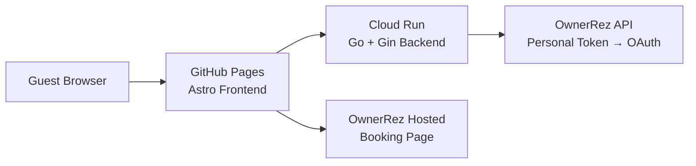

# Sapala Fun — Oceanfront Villas in St. Croix, USVI

Migrated from OwnerRez hosting to:

- **Frontend**: Astro static site hosted on GitHub Pages
- **Backend**: Go + Gin API hosted on Google Cloud Run
- **Booking**: OwnerRez hosted booking page (switchable to custom later)

## Architecture



## Project Structure

| Directory | Purpose |
|-----------|---------|
| `frontend/` | Astro static site (GitHub Pages) |
| `backend/` | Go + Gin API server (Cloud Run) |
| `docs/` | Documentation including OwnerRez API reference |
| `.github/workflows/` | CI/CD pipelines for both services |

## Local Development

### Full stack (one command)
```bash
make dev
```
Visit http://localhost:3001 — serves both frontend and API.

### Separate processes (mirrors production)
```bash
make dev-separate
```
- Frontend: http://localhost:4321 (hot-reload enabled)
- API: http://localhost:3001

## Environment Setup

Create `backend/.env` with:
```bash
OWNERREZ_API_BASE_URL="https://api.ownerrez.com"
OWNERREZ_EMAIL="your-email@example.com"
OWNERREZ_PERSONAL_TOKEN="your-personal-token-here"
```

The backend authenticates in this order: Personal Token → API Key → OAuth Token.

## Testing

| Command | Description |
|---------|-------------|
| `make test-all` | Run all tests (backend + frontend) |
| `make test-backend` | Backend unit tests |
| `make test-frontend` | Frontend Vitest tests |
| `make test-backend-api` | Backend API connection tests (validates `.env`) |

## Linting & Validation

| Command | Description |
|---------|-------------|
| `make lint-backend` | Go vet or golangci-lint |
| `make lint-frontend` | ESLint/Prettier |
| `make build-frontend` | Build Astro static site |

**Rule**: If you modify frontend files, run `make build-frontend` before backend testing.

## Deployment

### Frontend (GitHub Pages)
1. Push to `main` branch
2. GitHub Actions auto-deploys via `.github/workflows/deploy-pages.yml`

### Backend (Google Cloud Run)
Set secrets in GitHub repo settings:
- `GCLOUD_SERVICE_ACCOUNT_KEY` — GCP service account JSON
- `GCLOUD_REGION` — e.g., `us-central1`
- `GCLOUD_PROJECT` — your GCP project ID
- `OWNERREZ_PERSONAL_TOKEN` — your OwnerRez personal token

Then push to `main` branch → GitHub Actions auto-deploys via `.github/workflows/deploy-backend.yml`

## Design Flexibility

The Astro frontend uses a modular CSS approach. To try alternative designs:
1. Copy `frontend/src/styles/global.css` to a new file (e.g., `global-modern.css`)
2. Update the import in `frontend/src/layouts/Layout.astro`
3. Preview locally with `make dev-separate`
4. Switch back anytime

## Notes

- GitHub Pages is free for the static frontend
- Cloud Run has a generous free tier
- OwnerRez API secrets stay on the backend, never in the browser
- Booking currently uses OwnerRez's hosted booking page

See [AGENTS.md](./AGENTS.md) for developer workflow guidelines.
