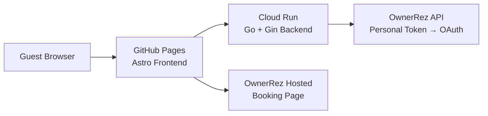

# Sapala Fun — Oceanfront Villas in St. Croix, USVI

Migrated from OwnerRez hosting to:

- **Frontend**: Astro static site hosted on GitHub Pages
- **Backend**: Go + Gin API hosted on Google Cloud Run
- **Booking**: OwnerRez hosted booking page (switchable to custom later)

## Architecture



## Structure

| Directory | Purpose |
|-----------|---------|
| `frontend/` | Astro static site (GitHub Pages) |
| `backend/` | Go + Gin API server (Cloud Run) |
| `docs/` | Documentation including OwnerRez API reference |
| `.github/workflows/` | CI/CD pipelines for both services |

## Local development

### Full stack (one command)
```bash
cd backend && go run .
```
Visit http://localhost:3001 — serves both frontend and API.

### Separate processes (mirrors production)
**Terminal 1 — Backend:**
```bash
cd backend && go run .
```

**Terminal 2 — Frontend:**
```bash
cd frontend && npm install && npm run dev
```
Visit http://localhost:4321 — calls API at http://localhost:3001.

## OwnerRez integration

### Current: Personal Token
```bash
export OWNERREZ_API_BASE_URL="https://api.ownerrez.com"
export OWNERREZ_PERSONAL_TOKEN="your-personal-token"
```

### Future: OAuth 2.0 (to be implemented)
```bash
export OWNERREZ_OAUTH_TOKEN="your-oauth-token"
```

The backend prioritizes credentials in this order: Personal Token → API Key → OAuth Token.

## Deployment

### Frontend (GitHub Pages)
1. Push to `main` branch
2. GitHub Actions auto-deploys via `.github/workflows/deploy-pages.yml`

### Backend (Google Cloud Run)
1. Set secrets in GitHub repo settings:
   - `GCLOUD_SERVICE_ACCOUNT_KEY` — GCP service account JSON
   - `GCLOUD_REGION` — e.g., `us-central1`
   - `GCLOUD_PROJECT` — your GCP project ID
   - `OWNERREZ_PERSONAL_TOKEN` — your OwnerRez personal token
2. Push to `main` branch
3. GitHub Actions auto-deploys via `.github/workflows/deploy-backend.yml`

## Design flexibility

The Astro frontend uses a modular CSS approach. To try alternative designs:
1. Copy `frontend/src/styles/global.css` to a new file (e.g., `global-modern.css`)
2. Update the import in `frontend/src/layouts/Layout.astro`
3. Preview locally with `npm run dev`
4. Switch back anytime

## Notes

- GitHub Pages is free for the static frontend
- Cloud Run has a generous free tier
- OwnerRez API secrets stay on the backend, never in the browser
- Booking currently uses OwnerRez's hosted booking page
